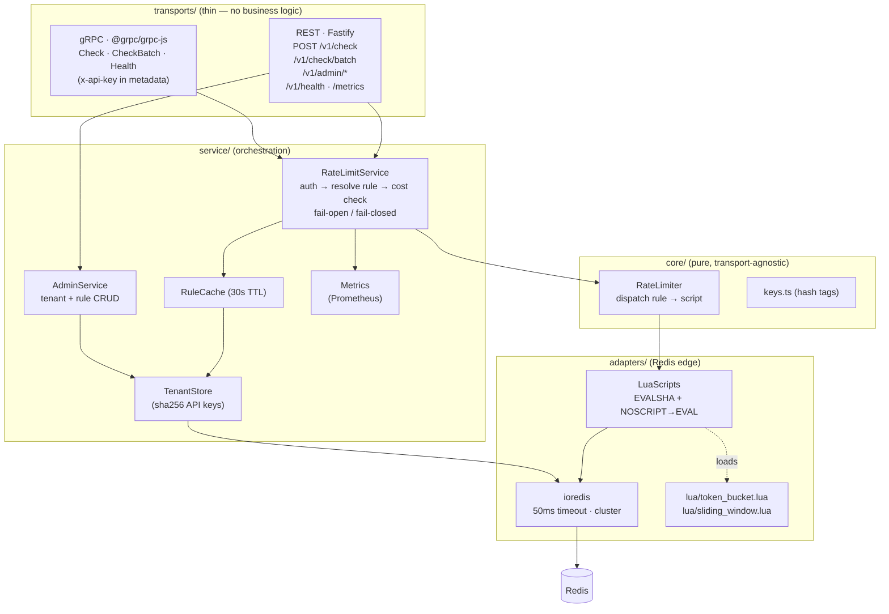

# Throttle — Distributed Rate Limiter as a Service

A production-grade, multi-tenant rate limiter exposed over **REST and gRPC** that share one core. Limiting decisions are made by **atomic Redis Lua scripts** (token bucket + sliding-window log), so they're correct under concurrency with no read-modify-write races. Built as infrastructure: strict layering, configurable fail-open/closed, Prometheus metrics, Redis-Cluster-ready keys.

```bash
docker compose up --build        # redis + service (REST :8080, gRPC :50051)
pnpm seed                        # demo tenant + 2 rules, prints curl/grpcurl examples
```

---

## Table of contents
1. [Architecture](#1-architecture)
2. [Algorithms & why Lua](#2-algorithms--why-lua)
3. [Multi-tenancy & key design](#3-multi-tenancy--key-design)
4. [Failure modes](#4-failure-modes)
5. [Benchmarks](#5-benchmarks)
6. [API reference](#6-api-reference)
7. [Configuration](#7-configuration)
8. [Testing](#8-testing)
9. [What I'd build next](#9-what-id-build-next-for-production)

---

## 1. Architecture

Strict layering — each layer imports only from the one below. **Both transports call the same `RateLimitService` → `RateLimiter` core. Zero duplicated limiter logic.**



**Request path for `POST /v1/check`:** transport parses the body and pulls the API key (`X-API-Key` header / gRPC `x-api-key` metadata) → `RateLimitService` resolves the API key to a tenant (sha256 lookup), loads the rule (in-process cache, else Redis), validates `cost ≤ ceiling` → `RateLimiter` builds the hash-tagged key and runs the one Lua script for that algorithm → the `Decision` flows back, the transport attaches `X-RateLimit-*` headers (REST) and returns `allowed/remaining/retryAfterMs`.

---

## 2. Algorithms & why Lua

### Why a single Lua script (and not MULTI/EXEC or app-side check-then-set)

Every check is **read → compute → conditional write**: read current state, decide allow/deny from it, then write only if allowed. That branch-on-a-value-you-just-read is the crux.

Concrete race with app-side logic — sliding window, `limit = 10`, current count `9`, two requests land together:

```
  req A: ZCARD → 9          req B: ZCARD → 9        (both read before either writes)
  req A: 9 < 10 → ZADD      req B: 9 < 10 → ZADD    → 11 admitted. Limit breached.
```

- **MULTI/EXEC doesn't fix it.** It only *queues* commands and runs them with no intermediate reads — it cannot make the allow/deny decision that depends on the `ZCARD` reply.
- **WATCH + optimistic retry fixes correctness but not performance.** Under contention on a hot key, every concurrent request CAS-fails and retries — a thundering herd exactly where a limiter is busiest.
- **One Lua script** runs `evict → count → conditionally add` server-side as a single indivisible unit. req B observes count `10` and is denied. No interleaving exists.

This is proven by [`test/concurrency.atomicity.test.ts`](test/concurrency.atomicity.test.ts): 100 parallel checks at one key with limit 10 → **exactly 10 allowed**, for both algorithms.

### Comparison

| | **Token bucket** | **Sliding-window log** |
| --- | --- | --- |
| State per key | 1 hash `{tokens, lastRefillMs}` — **O(1)** | 1 ZSET, one member per in-window request — **O(limit)** |
| Memory | tiny, constant | grows with traffic up to `limit` entries |
| Burst behaviour | **allows bursts** up to `capacity`, then throttles to `refillRate` | no bursts — smooth, exact count in any window |
| Precision | approximate (continuous refill) | **exact** — true rolling window |
| Boundary spikes | none | none (rolling, not fixed buckets) |
| Best for | APIs that should tolerate bursts (most product APIs) | hard caps where exactness matters (billing, quotas) |
| Params | `capacity`, `refillRate` (tok/s), `cost?` | `limit`, `windowMs`, `cost?` |

Both: **server clock** via `redis.call('TIME')` (never trust caller clocks — a fast/forged clock could mint free tokens), a **TTL on every key** (idle buckets self-expire once refilled / one window passes → bounded memory), and a hash-tagged key for Cluster.

> The Lua scripts accept an optional `nowOverrideMs` argument used **only by tests** for deterministic simulated time; production always passes `0` so the script reads the server clock.

Sources: [`token_bucket.lua`](src/adapters/lua/token_bucket.lua) · [`sliding_window.lua`](src/adapters/lua/sliding_window.lua) — each carries the full race-condition comment block.

---

## 3. Multi-tenancy & key design

- **Tenants** are identified by an **API key** (`X-API-Key` header / `x-api-key` gRPC metadata). Keys are stored **only as a sha256 digest** (`throttle:tenants:<sha256>` → tenantId), so a Redis dump never leaks a usable credential; lookup stays an O(1) `GET`.
- **Rules** are named per tenant (`throttle:rules:{tenantId}` hash, `ruleId` → JSON) and cached in-process for **30s**. *Staleness trade-off:* a rule edit is visible immediately on the instance that made it (local cache invalidation) and within 30s on other instances. Pushing that to near-zero is the pub/sub item in §9.
- **Admin API** (`/v1/admin/*`) is guarded by a **separate** `ADMIN_API_KEY`, distinct from any tenant key.

### Key design & Redis Cluster

```
throttle:{tenantId:ruleId:identifier}:tb       ← token bucket
throttle:{tenantId:ruleId:identifier}:sw       ← sliding window
         └────────── hash tag ──────────┘
```

Redis Cluster hashes only the substring inside `{...}` to choose a slot. Wrapping the whole logical identity guarantees a given (tenant, rule, identifier) maps to **one slot** — required because a Lua script may only touch keys in a single slot (else `CROSSSLOT`). Different identifiers still spread across the cluster, so one tenant doesn't become a single hot node.

**Hot keys:** the worst case is many clients sharing one identifier (e.g. a global limit). Mitigations (not all implemented; called out honestly): shard one logical key into _N_ sub-buckets and sum/spread; a local token-lease cache that draws _k_ tokens at a time to cut Redis traffic; read replicas for the count. The batch endpoint already amortises by doing up to 50 checks in one pipelined round-trip.

---

## 4. Failure modes

| Failure | Behaviour | Mitigation / rationale |
| --- | --- | --- |
| **Redis down** | `FAIL_OPEN=true` → allow (degraded, loud warn, `throttle_redis_errors_total++`). `FAIL_OPEN=false` → `503` / gRPC `UNAVAILABLE`. | Choose per blast radius — see below. Client errors (bad key/rule/cost) are **never** masked by fail-open; only backend errors are. |
| **Slow Redis** | Per-command **50ms timeout** (`REDIS_COMMAND_TIMEOUT_MS`); a timeout throws and takes the *same* fail-open/closed path as "down". | A slow dependency is treated as a down dependency — no unbounded request latency. |
| **Redis restart / failover** | Scripts vanish (`NOSCRIPT`); the adapter reloads the source and retries the EVAL once, transparently. | Hot path stays on EVALSHA (just the SHA on the wire); correctness survives lifecycle events. |
| **Caller clock skew** | Irrelevant — refill/window math uses `redis.call('TIME')`, never the client. | Prevents free-token minting via a forged/fast clock. |
| **Hot key** | One slot/node takes the load for a shared identifier. | Hash-tag isolation per identity; batch amortisation; sharding/leasing as future work (§3). |
| **Unbounded memory** | Avoided — every key gets a TTL (token bucket: full-refill time; sliding window: one window). | Idle keys self-expire; ZSET size is bounded by `limit`. |
| **Process shutdown** | Graceful: stop accepting on both transports, drain in-flight, quit Redis; 10s hard deadline forces exit. | No dropped in-flight requests on deploy. |

**Fail-open vs fail-closed — when to pick which.** Fail **open** for product/content APIs where availability beats perfect enforcement: a Redis blip shouldn't take down the product, and briefly un-limited traffic is survivable. Fail **closed** for auth, OTP, payments, or any scarce/abusable resource where letting unlimited traffic through during an outage is worse than returning 503 — there, protection beats availability. It's a per-deployment env flag because the right answer depends on what sits behind the limiter.

---

## 5. Benchmarks

`pnpm loadtest` (autocannon, 50 connections, 10s/scenario) against the app running in Docker on this machine. Numbers are honest single-box results, not a tuned cluster.

**Machine:** Darwin 25.3.0 · 8 vCPU · Apple M1 · Node v22 · Redis 7-alpine (docker-compose, same host)

| Scenario | Req/s | Checks/s | p50 (ms) | p97.5 (ms) | p99 (ms) |
| --- | --- | --- | --- | --- | --- |
| single hot key | 6,544 | 6,544 | 6 | 14 | 18 |
| 1000 distinct keys | 6,333 | 6,333 | 7 | 12 | 15 |
| batch (50 checks/req) | 1,045 | 52,250 | 43 | 80 | 148 |

Takeaways: single-check throughput is ~6.5k req/s with p99 < 20ms; the hot key isn't meaningfully slower than spread keys (Redis is single-threaded, the script is O(1)/O(limit)); **batching is the throughput multiplier** — 50 limits per HTTP round-trip pushes effective decisions past 50k/s. _(autocannon reports p97.5, not p95.)_

---

## 6. API reference

### REST (`:8080`)
| Method & path | Auth | Body | Result |
| --- | --- | --- | --- |
| `POST /v1/check` | `X-API-Key` | `{rule, identifier, cost?}` | `200 {allowed,remaining,limit,resetMs}` / `429 {allowed:false,remaining:0,retryAfterMs}` + `Retry-After`. Always sets `X-RateLimit-Limit/Remaining/Reset` (Reset = unix secs). |
| `POST /v1/check/batch` | `X-API-Key` | `{checks:[…≤50]}` | `{results:[…]}` — per item a decision or `{error}` (partial results) |
| `POST /v1/admin/tenants` | admin key | — | `201 {tenantId, apiKey}` (key shown once) |
| `PUT /v1/admin/tenants/:id/rules/:ruleId` | admin key | rule def | `{rule}` |
| `GET /v1/admin/tenants/:id/rules` | admin key | — | `{rules}` |
| `DELETE /v1/admin/tenants/:id/rules/:ruleId` | admin key | — | `204` / `404` |
| `GET /v1/health` | — | — | `{status, redis:"up"\|"down", uptimeMs}` |
| `GET /metrics` | — | — | Prometheus text |

### gRPC (`:50051`, package `throttle.v1`)
`RateLimiter.Check` · `CheckBatch` · `Health` — same semantics; API key in `x-api-key` metadata. A **deny is not an error** (`allowed=false`); genuine failures map to status codes (`UNAUTHENTICATED`, `NOT_FOUND`, `INVALID_ARGUMENT`, `UNAVAILABLE`). Proto: [`proto/throttle.proto`](proto/throttle.proto). Examples: [`examples/`](examples/).

### Rule definition
```jsonc
// token bucket
{ "algorithm": "token_bucket", "capacity": 10, "refillRate": 5, "cost": 1 }
// sliding window
{ "algorithm": "sliding_window", "limit": 100, "windowMs": 60000, "cost": 1 }
```

### Metrics
`throttle_checks_total{tenant,rule,allowed}` · `throttle_redis_errors_total` · `throttle_check_duration_ms` (histogram).

---

## 7. Configuration

All via env (see [`.env.example`](.env.example)). Defaults shown.

| Var | Default | Purpose |
| --- | --- | --- |
| `HTTP_PORT` / `GRPC_PORT` | `8080` / `50051` | transport ports |
| `REDIS_URL` | `redis://127.0.0.1:6379` | Redis connection |
| `REDIS_CLUSTER` | `false` | connect in Cluster mode |
| `REDIS_COMMAND_TIMEOUT_MS` | `50` | per-command timeout (slow == down) |
| `FAIL_OPEN` | `true` | allow vs reject when Redis is down |
| `ADMIN_API_KEY` | `dev-admin-key-change-me` | guards `/v1/admin/*` |
| `RULE_CACHE_TTL_MS` | `30000` | in-process rule cache TTL |
| `LOG_LEVEL` | `info` | pino level |

---

## 8. Testing

```bash
pnpm test          # Vitest against a REAL Redis (Testcontainers) — Lua/atomicity can't be mocked
pnpm typecheck     # strict tsc
pnpm lint          # eslint — no `any` outside adapters/
```

Coverage: token-bucket (burst, refill over simulated time, `cost>1`, `cost>capacity`, TTL) · sliding-window (limit, exact `±1ms` boundary, resetMs, TTL) · **100-parallel atomicity** · fail-open/closed (Redis killed mid-test) · batch partial results · **REST↔gRPC parity** (identical decisions through both transports) · metrics exposition.

---

## 9. What I'd build next for production

Short and honest — these are deliberately out of scope here:

- **Multi-region.** A single Redis is a single region. Options, cheapest-first: (a) **regional independent limiters** with per-region sub-limits — simple, but global limit is only approximate; (b) **async cross-region reconciliation** (ship counters, eventually-consistent) — better accuracy, bounded staleness; (c) **CRDT-style counters** for sliding-window-counter — converge without coordination at the cost of allowing brief over-admission. Most products want (a) or (b); true global exactness needs consensus and isn't worth the latency.
- **Local in-process cache + async sync.** Lease _k_ tokens per key locally, refill from Redis in the background. Slashes Redis traffic on hot keys; trade-off is short windows of local over/under-counting — fine for fairness limits, not for hard quotas.
- **Sliding-window *counter*** as a memory optimization: two fixed buckets + interpolation instead of a full log. O(1) memory vs O(limit), ~exact. The right default at scale; the log variant here is the exact reference.
- **Rule hot-reload via pub/sub.** Publish on rule writes; instances invalidate their cache instantly → drops the 30s staleness window to ~zero without polling.
- **gRPC server reflection** so `grpcurl` works without the `.proto`; **auth hardening** (key rotation, scopes); **OpenTelemetry traces** alongside the metrics.

---

### Project layout
```
src/adapters/   config, ioredis factory, Lua script loader (EVALSHA), *.lua
src/core/       types, hash-tag keys, RateLimiter (pure dispatch)
src/service/    tenant store, rule cache, RateLimitService (policy), AdminService, errors
src/transports/ rest/ (Fastify), grpc/ (@grpc/grpc-js)
src/metrics.ts  hand-rolled Prometheus
proto/          throttle.proto (throttle.v1)
scripts/        seed.ts, loadtest.ts + loadtest.sh
examples/       curl.sh, grpc.sh, client.ts
test/           Vitest (Testcontainers Redis)
```
